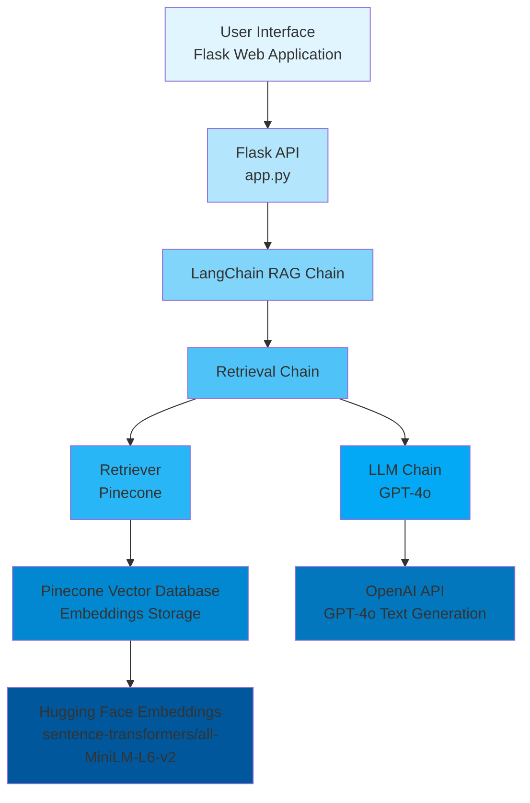
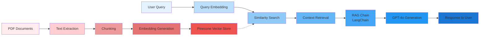

# 🏥 Medical Chatbot - AI-Powered Healthcare Assistant


A sophisticated Retrieval-Augmented Generation (RAG) based medical chatbot that provides intelligent responses to medical queries by leveraging vector embeddings and large language models. The system processes medical documents, creates semantic embeddings, and retrieves contextually relevant information to generate accurate and helpful responses.

---

## 📋 Table of Contents

- [Overview](#overview)
- [Features](#features)
- [Technology Stack](#technology-stack)
- [Architecture](#architecture)
- [Project Structure](#project-structure)
- [Prerequisites](#prerequisites)
- [Installation & Setup](#installation--setup)
- [Usage](#usage)
- [Deployment](#deployment)
- [Contributing](#contributing)
- [License](#license)

---

## 🎯 Overview

This Medical Chatbot application combines the power of:
- **Vector Search**: Pinecone vector database for semantic similarity search
- **LLM Integration**: OpenAI GPT-4o for natural language understanding and generation
- **RAG Architecture**: Retrieval-Augmented Generation for context-aware responses
- **Document Processing**: Automated PDF parsing and chunking for knowledge base creation

The system is designed to assist users with medical information queries by retrieving relevant context from medical documents and generating informed responses.

---

## ✨ Features

- 🤖 **Intelligent Q&A**: Context-aware responses using RAG architecture
- 📚 **Document Processing**: Automatic PDF parsing and text chunking
- 🔍 **Semantic Search**: Vector-based similarity search for relevant information
- 🌐 **Web Interface**: User-friendly Flask-based chat interface
- 🐳 **Docker Support**: Containerized deployment ready
- ☁️ **Cloud Deployment**: AWS ECR/EC2 deployment with GitHub Actions CI/CD
- 🔒 **Secure**: Environment-based API key management

---

## 🛠 Technology Stack

### Core Technologies
- **Python 3.10**: Primary programming language
- **Flask 3.1.1**: Web framework for API and UI
- **LangChain 0.3.26**: RAG framework and chain orchestration
- **OpenAI GPT-4o**: Large language model for text generation
- **Pinecone**: Vector database for embeddings storage and retrieval

### Supporting Libraries
- **sentence-transformers 4.1.0**: Hugging Face embeddings model
- **langchain-pinecone 0.2.8**: Pinecone integration for LangChain
- **langchain-openai 0.3.24**: OpenAI integration for LangChain
- **langchain-community 0.3.26**: Community integrations
- **pypdf 5.6.1**: PDF document processing
- **python-dotenv 1.1.0**: Environment variable management

### Infrastructure & DevOps
- **Docker**: Containerization
- **AWS ECR**: Container registry
- **AWS EC2**: Compute infrastructure
- **GitHub Actions**: CI/CD pipeline

---

## 🏗 Architecture

### System Architecture Diagram



### Data Flow Diagram



### Component Details

1. **Document Processing Pipeline**
   - PDF loading and text extraction
   - Text chunking (500 chars, 20 overlap)
   - Embedding generation using Hugging Face models
   - Vector storage in Pinecone

2. **Query Processing Pipeline**
   - User query embedding
   - Similarity search in Pinecone (top 3 results)
   - Context retrieval and prompt construction
   - LLM-based answer generation

3. **RAG Chain Architecture**
   - Retrieval: Pinecone vector search
   - Augmentation: Context injection into prompt
   - Generation: GPT-4o response generation

---

## 📁 Project Structure

```
Medical-Chatbot/
│
├── app.py                 # Main Flask application
├── store_index.py         # Script to process PDFs and store embeddings
├── requirements.txt       # Python dependencies
├── Dockerfile             # Docker container configuration
├── setup.py               # Package setup configuration
├── .env                   # Environment variables (not in repo)
│
├── src/                   # Source code modules
│   ├── __init__.py
│   ├── helper.py          # PDF processing and embedding utilities
│   └── prompt.py          # System prompts for LLM
│
├── data/                  # Medical documents
│   └── Medical_book.pdf   # Source medical knowledge base
│
├── templates/             # Flask HTML templates
│   └── chat.html          # Chat interface UI
│
├── static/                # Static assets
│   └── style.css          # CSS styling
│
├── research/              # Research and experimentation
│   └── trials.ipynb       # Jupyter notebooks
│
└── README.md              # This file
```

---

## 📋 Prerequisites

Before you begin, ensure you have the following installed:

- **Python 3.10** or higher
- **Conda** or **virtualenv** for environment management
- **Docker** (optional, for containerized deployment)
- **Git** for version control

### API Keys Required

- **OpenAI API Key**: Get from [OpenAI Platform](https://platform.openai.com/)
- **Pinecone API Key**: Get from [Pinecone Console](https://app.pinecone.io/)

---

## 🚀 Installation & Setup

### Step 1: Clone the Repository

```bash
git clone https://github.com/yourusername/Medical-Chatbot-.git
cd Medical-Chatbot-
```

### Step 2: Create Conda Environment

```bash
conda create -n medibot python=3.10 -y
conda activate medibot
```

### Step 3: Install Dependencies

```bash
pip install -r requirements.txt
```

### Step 4: Configure Environment Variables

Create a `.env` file in the root directory:

```ini
PINECONE_API_KEY=your_pinecone_api_key_here
OPENAI_API_KEY=your_openai_api_key_here
```

### Step 5: Process Documents and Create Vector Index

```bash
python store_index.py
```

This script will:
- Load PDF documents from the `data/` directory
- Split them into text chunks
- Generate embeddings
- Store them in Pinecone vector database

### Step 6: Run the Application

```bash
python app.py
```

The application will start on `http://localhost:8080`

---

## 💻 Usage

1. **Start the Application**: Run `python app.py`
2. **Open Browser**: Navigate to `http://localhost:8080`
3. **Ask Questions**: Type medical queries in the chat interface
4. **Get Responses**: The system will retrieve relevant context and generate informed answers

### Example Queries

- "What are the symptoms of diabetes?"
- "Explain the treatment for hypertension"
- "What is the recommended dosage for aspirin?"

---

## 🚢 Deployment

### AWS Deployment with GitHub Actions CI/CD

The project includes automated deployment to AWS using GitHub Actions.

#### Prerequisites

1. **AWS Account** with:
   - EC2 access
   - ECR (Elastic Container Registry) access
   - IAM user with appropriate permissions

2. **GitHub Secrets** configured:
   - `AWS_ACCESS_KEY_ID`
   - `AWS_SECRET_ACCESS_KEY`
   - `AWS_DEFAULT_REGION`
   - `ECR_REPO`
   - `PINECONE_API_KEY`
   - `OPENAI_API_KEY`

#### Deployment Steps

1. **Create ECR Repository**
   ```bash
   aws ecr create-repository --repository-name medibot
   ```
   Save the repository URI (e.g., `315865595366.dkr.ecr.us-east-1.amazonaws.com/medibot`)

2. **Launch EC2 Instance**
   - Choose Ubuntu AMI
   - Configure security groups (allow port 8080)
   - Create and download key pair

3. **Install Docker on EC2**
   ```bash
   sudo apt-get update -y
   curl -fsSL https://get.docker.com -o get-docker.sh
   sudo sh get-docker.sh
   sudo usermod -aG docker ubuntu
   newgrp docker
   ```

4. **Configure GitHub Actions Runner**
   - Go to repository Settings → Actions → Runners
   - Add new self-hosted runner
   - Follow instructions to configure on EC2

5. **Push Code to GitHub**
   - The GitHub Actions workflow will automatically:
     - Build Docker image
     - Push to ECR
     - Deploy to EC2

#### IAM Policies Required

- `AmazonEC2ContainerRegistryFullAccess`
- `AmazonEC2FullAccess`

---

## 🔧 Configuration

### Environment Variables

| Variable | Description | Required |
|----------|-------------|----------|
| `PINECONE_API_KEY` | Pinecone API key for vector database | Yes |
| `OPENAI_API_KEY` | OpenAI API key for GPT-4o | Yes |

### Application Settings

- **Port**: Default `8080` (configurable in `app.py`)
- **Host**: `0.0.0.0` for Docker compatibility
- **Pinecone Index**: `medical-bot` (configurable in `app.py`)
- **Embedding Model**: `sentence-transformers/all-MiniLM-L6-v2`
- **LLM Model**: `gpt-4o`
- **Chunk Size**: 500 characters
- **Chunk Overlap**: 20 characters
- **Retrieval Count**: Top 3 similar documents

---

## 🧪 Development

### Running in Development Mode

```bash
export FLASK_ENV=development
python app.py
```

### Testing

```bash
# Run tests (if available)
pytest tests/
```

### Adding New Documents

1. Place PDF files in the `data/` directory
2. Run `python store_index.py` to update the vector database

---

## 🤝 Contributing

Contributions are welcome! Please follow these steps:

1. Fork the repository
2. Create a feature branch (`git checkout -b feature/amazing-feature`)
3. Commit your changes (`git commit -m 'Add some amazing feature'`)
4. Push to the branch (`git push origin feature/amazing-feature`)
5. Open a Pull Request

---

## 📝 License

This project is licensed under the MIT License - see the [LICENSE](LICENSE) file for details.

---

## ⚠️ Disclaimer

**IMPORTANT**: This chatbot is for informational purposes only and should not be used as a substitute for professional medical advice, diagnosis, or treatment. Always seek the advice of qualified health providers with any questions regarding a medical condition.

---

## 📞 Support

For issues, questions, or contributions, please open an issue on the GitHub repository.

---

## 🙏 Acknowledgments

- **LangChain** for the RAG framework
- **OpenAI** for GPT-4o
- **Pinecone** for vector database services
- **Hugging Face** for embedding models

---

**Built with ❤️ for better healthcare information access**
